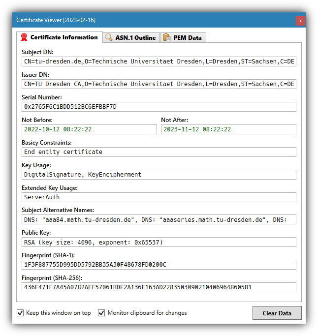

# CertViewer

**A simple X.509 certificate viewer for Microsoft Windows.**

## Usage

In order to display a X.509 certificate, either drop a certificate file in *binary* (DER) or *Base64-encoded* (PEM) format onto the CertViewer window, or simply copy a certificate in PEM format to the clipboard.

Note: By default, the CertViewer automatically monitors the clipboard for certificates in the PEM format.

## Prerequisites

The [.NET Framework 4.7.2](https://dotnet.microsoft.com/en-us/download/dotnet-framework/net472) or later is required!

## License

This work has been released under the MIT license. See [LICENSE.txt](LICENSE.txt) for details!

### Acknowledgements

CertViewer uses the [Bouncy Castle](https://github.com/bcgit/bc-csharp) Cryptography library.
