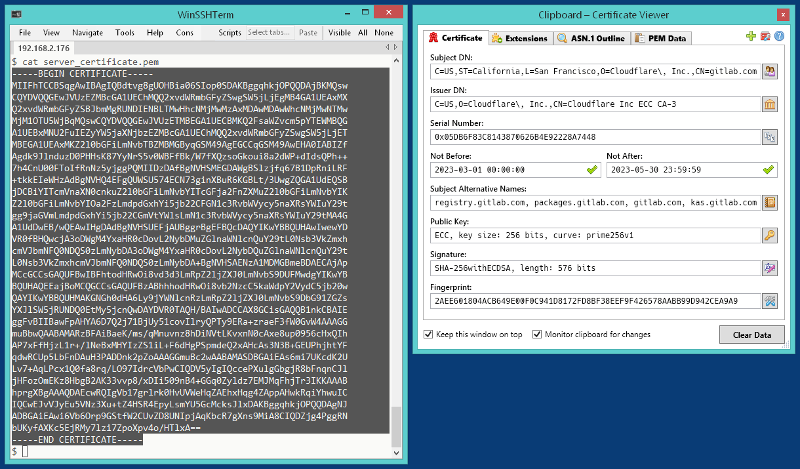
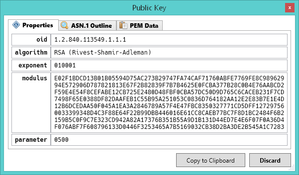
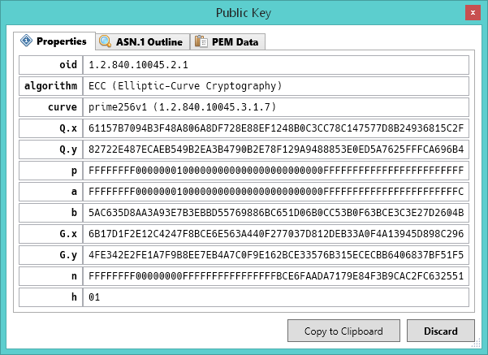
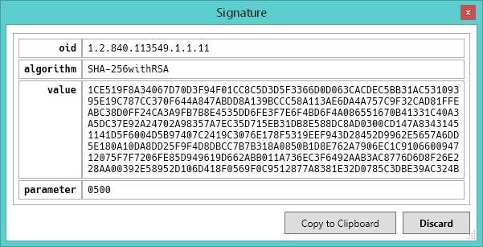

# CertViewer


**A simple X.509 certificate viewer for Microsoft Windows.**









## Usage

In order to display an X.509 certificate, simply ***drop*** a certificate file onto the CertViewer window. Alternatively, you can ***copy*** a certificate to the clipboard &ndash; by default, CertViewer continuously monitors the clipboard for "displayable" certificates. Last, but not least, it is possible to pass certificates to CertViewer via the *command-line*.

CertViewer currently supports certificates in the [*binary* (DER)](https://en.wikipedia.org/wiki/X.690) and the [*Base64-encoded* (PEM)](https://en.wikipedia.org/wiki/Privacy-Enhanced_Mail) format, as well as key-stores in the [PKCS #12 (PFX)](https://en.wikipedia.org/wiki/PKCS_12) and the [JKS (Java KeyStore)](https://en.wikipedia.org/wiki/Java_KeyStore) format, including password-protected files.

## Prerequisites

The [.NET Framework 4.7.2](https://dotnet.microsoft.com/en-us/download/dotnet-framework/net472) or later is required!

It is already included in Windows 10 v1803 (April 2018 Update) or later, and *all* versions of Windows 11.

## Configuration

The program settings can be adjusted in the **`CertViewer.exe.config`** configuration file:

```xml
<configuration>
    …
    <appSettings>
        <add key="SettingName1" value="SettingValue1" />
        <add key="SettingName2" value="SettingValue2" />
        …
    </appSettings>
</configuration>
```

### Settings

The following program settings are currently supported:

* **`DigestAlgorithm`**  
  The digest algorithm to be used for "fingerprint" computation. Default value: `SHA256`.

  *Supported digest algorithms:*  
  `MD5`, `RIPEMD160`, `SHA1`, `BLAKE2_160`, `BLAKE2_256`, `BLAKE3`, `SHA224`, `SHA256`, `SHA3_224`, `SHA3_256`

* **`MaximumInputLength`**  
  Maximum input file length to read, in bytes. Default value: `16777216` (16 MiB).

* **`MonitorClipboard`**  
  Monitor the clipboard for "viewable" certificates in the PEM format. Default value: `True`.

* **`ReverseNameOrder`**  
  Display distinguished name components in *reverse* order (as per RFC 2253). Default value: `True`.

* **`Topmost`**  
  Keep the CertViewer window on top of all other windows. Default value: `True`.

* **`EnableUpdateCheck`**  
  Automatically check for new program versions at application startup. Default value: `True`.

## Logging

Optional [tracing](https://en.wikipedia.org/wiki/Tracing_(software)) can be enabled in the **`CertViewer.exe.config`** configuration file:

```xml
<configuration>
    …
    <system.diagnostics>
        <switches>
            <add name="Tracing" value="True" />
        </switches>
    </system.diagnostics>
</configuration>
```

You can use a program like Sysinternals [**`DebugView`**](https://learn.microsoft.com/en-us/sysinternals/downloads/debugview) to display the tracing messages generated by CertViewer.

## Website

For news and updates, please check the official project website at:  
<https://deajl3ka.github.io/certviewer/>

**Git mirrors:**

* <https://github.com/dEajL3kA/certviewer>
* <https://codeberg.org/dEajL3kA/CertViewer>
* <https://gitlab.com/deajl3ka1/CertViewer>
* <https://repo.or.cz/certviewer.git>

## Contact information

E-Mail:  
<Cumpoing79@web.de>

OpenPGP key:  
[`F81B 9C6C 6C3A 7F46 4173  3F5E E9C6 473D 4E97 DAD1`](https://keys.openpgp.org/vks/v1/by-fingerprint/F81B9C6C6C3A7F4641733F5EE9C6473D4E97DAD1)

## License

Copyright (c) 2025 "dEajL3kA" &lt;Cumpoing79@web.de&gt;  
This work has been released under the MIT license. See [LICENSE.txt](LICENSE.txt) for details!

### Acknowledgement

CertViewer includes the following works:

* **[Bouncy Castle](https://github.com/bcgit/bc-csharp) Cryptography Library For .NET**  
  MIT license  
  Copyright (c) 2000-2025 The Legion of the Bouncy Castle Inc.

* **[Costura](https://github.com/Fody/Costura) Fody Add-in**  
  MIT license  
  Copyright (c) 2012 Simon Cropp and contributors

* **[Farmhash.Sharp](https://github.com/nickbabcock/Farmhash.Sharp)  Hash Algorithm**  
  MIT license  
  Copyright (c) 2014-2015 Google, Inc., Nick Babcock

* **[Hack Font](https://github.com/source-foundry/Hack) Typeface Design**  
  MIT license  
  Copyright (c) 2018 Source Foundry Authors

* **[Farm-Fresh Web](https://web.archive.org/web/20160323032439/http://www.fatcow.com/free-icons) Icons by FatCow**  
  Free for personal and commercial use with attribution

* **[Certificate Icons](https://www.flaticon.com/free-icon/certificate_3885250) by DinosoftLabs**  
  Free for personal and commercial use with attribution
