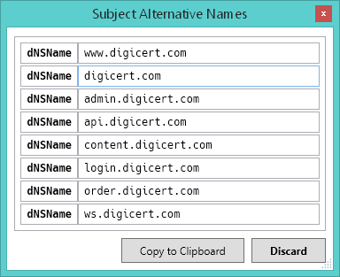

# CertViewer

**A simple X.509 certificate viewer for Microsoft Windows.**

## Usage

In order to display an X.509 certificate, simply ***drop*** a certificate file in the *binary* (DER) or the *Base64-encoded* (PEM) format onto the CertViewer window. Alternatively, you can ***copy*** a certificate in the PEM format to the clipboard. Last but not least, it is also possible to pass a certificate file to CertViewer via command-line parameter.

**Note:** By default, CertViewer continuously monitors the clipboard for "viewable" certificates in the PEM format.

## Prerequisites

The [.NET Framework 4.7.2](https://dotnet.microsoft.com/en-us/download/dotnet-framework/net472) or later is required!

It is already included in Windows 10 v1803 (April 2018 Update) or later, and *all* versions of Windows 11.

# Default settings

The ***default*** settings can be adjusted in the **`CertViewer.exe.config`** configuration file:

* **`DigestAlgorithm`**  
  Default digest algorithms for "fingerprint" computation  
  `MD5`, `RIPEMD160`, `SHA1`, `BLAKE2_160`, `BLAKE2_256`, `SHA224`, `SHA256`, `SHA3_224`, or `SHA3_256`

* **`Topmost`**  
  Keep the CertViewer window on top of all other windows (boolean)

* **`MonitorClipboard`**  
  Monitor the clipboard for "viewable" certificates in the PEM format (boolean)

## Website

For news and updates, please check the official GitHub project website at:  
<https://github.com/dEajL3kA/certviewer>

## License

Copyright (c) 2023 "dEajL3kA" &lt;Cumpoing79@web.de&gt;  
This work has been released under the MIT license. See [LICENSE.txt](LICENSE.txt) for details!

### Acknowledgement

CertViewer includes the following works:

* **[Bouncy Castle](https://github.com/bcgit/bc-csharp) Cryptography Library For .NET**  
  MIT license  
  Copyright (c) 2000-2023 The Legion of the Bouncy Castle Inc.

* **[Costura](https://github.com/Fody/Costura) Fody Add-in**  
  MIT license  
  Copyright (c) 2012 Simon Cropp and contributors

* **[Farm-Fresh Web](http://www.fatcow.com/free-icons) Icons by FatCow**  
  CC BY 3.0 license  
  Copyright (c) 2009-2014 FatCow Web Hosting

* **[Hack Font](https://github.com/source-foundry/Hack) Typeface Design**  
  MIT license  
  Copyright (c) 2018 Source Foundry Authors
